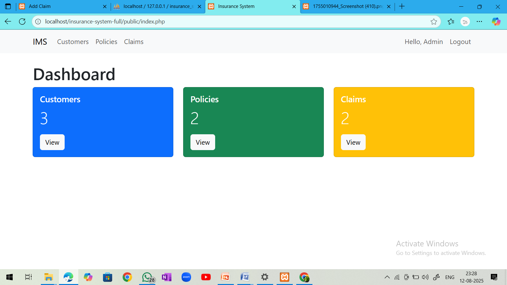

# 🛡 Insurance Management System in PHP & MySQL

A robust web-based Insurance Management System built with **PHP** and **MySQL** to manage customers, policies, and claims efficiently.  
Ideal for **students** (final year projects, portfolios), **recruiters** (skill evaluation), and **businesses** (ready-to-use solution).

---

## 🚀 Features

- Secure Admin & Customer Login  
- Manage Customers (Add, Edit, Delete)  
- Manage Insurance Policies  
- Manage Claims and Requests  
- Generate Reports and Analytics  
- Responsive UI built with Bootstrap  
- Database-driven with MySQL  

---

## 🛠 Technology Stack

| Layer    | Technology         |
| -------- | ------------------ |
| Frontend | HTML, CSS, Bootstrap |
| Backend  | PHP (Core PHP)       |
| Database | MySQL (phpMyAdmin)   |
| Server   | XAMPP/WAMP (Local) or cPanel Hosting |

---

## 📂 Demo Files Included

This repository contains:  
- Sample PHP files with basic structure  
- Screenshots of the working system  
- Project documentation  

**Note:** The full working source code with database SQL file is **NOT included** here.

---

## 💰 Purchase Full Source Code

Interested in the full source code?  
Contact: **rashmipravamishra@gmail.com**  
Payment Methods: UPI / PayPal / Bank Transfer  

Includes:  
- Complete PHP source code  
- MySQL database export (.sql)  
- Installation guide and documentation  
- Lifetime support  

---

## 🖥 Live Demo

Check out the demo: [Insert Demo URL here]

---

## 📸 Screenshots

### Dashboard  

### Loginadmin Page  

### Loginuser Page  

### Customer detail Page  

### Dashboard Page  

### Register Page  

### Customer List Page  

---

## ⚠ License & Usage

This project is for educational and commercial use.  
Redistribution or resale without permission is prohibited.

---

⭐ If you find this project useful, please star this repository!

---

## Contact

For any queries, please email: rashmipravamishra@gmail.com

